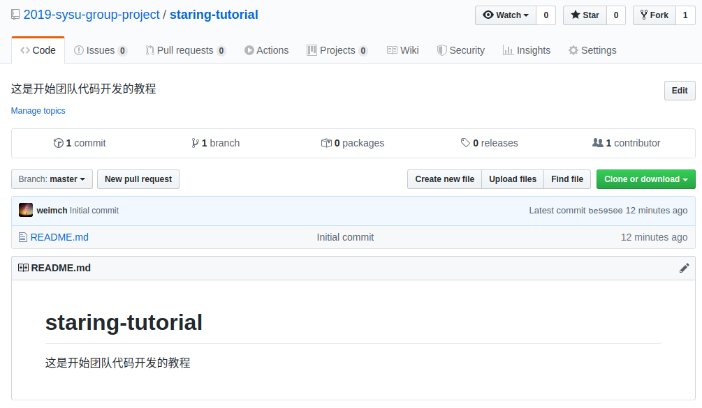
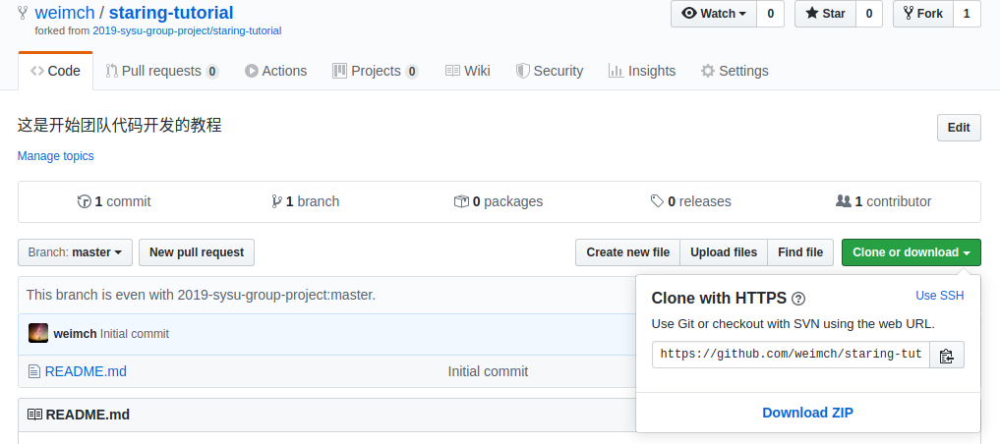
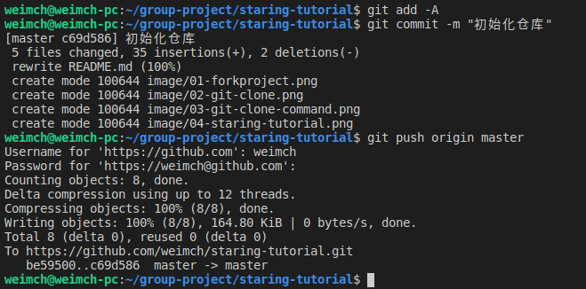
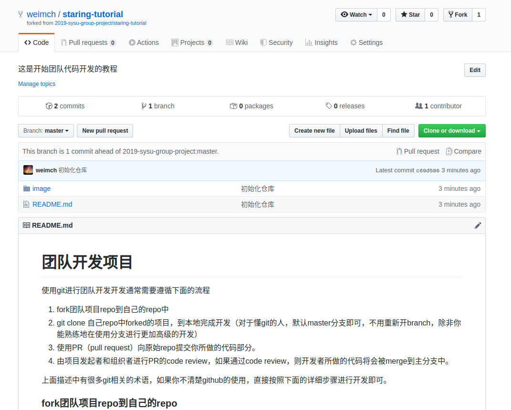
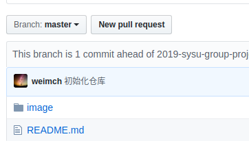
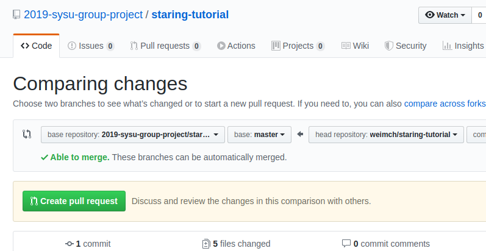

# 团队开发项目

使用git进行团队开发开发通常需要遵循下面列出的流程

1. fork团队项目repo到自己的repo中
2. git clone 自己repo中forked的项目，到本地完成开发（对于懂git的人，默认master分支即可，不用重新开branch，除非你能熟练地在使用分支进行更加高级的开发）
3. 使用PR（pull request）向原始repo提交你所做的代码部分。
4. 由项目发起者和组织者进行PR的code review，如果通过code review，则开发者所做的代码将会被merge到主分支中。

上面描述中有很多git相关的术语，如果你不清楚github的使用，直接按照下面的详细步骤进行开发即可。

### 1. fork团队项目repo到自己的repo

点击你要参与开发的项目，比如，该项目



点击右上角的Fork，然后项目就会被fork到你的名下

### 2. 开发项目

执行如下命令将项目下载到本地进行开发。(你的git_url就是下图那串网址)
```console
git clone your_git_url
```



当你完成自己负责部分项目的开发时，连续使用下面的命令将代码上传到你的github仓库中，第二行中的"Your Message"用于描述代码所做的修改或者所完成的功能，如果你不确定自己完成了什么功能，也可以任意写
```
git add -A
git commit -m "Your Message"
git push origin master
```
*PS: 如果你熟悉你所开发使用的IDE的git相关操作的话，也可以直接通过IDE的git相关按钮完成提交，使用IDE的方式更加简单*

命令行执行后的输出例子如下



一个push到自己的远程仓库的例子如下面所示



### 3. 提交代码到主仓库中
**注意：当前你只是在自己的仓库中进行开发，你所做的所有代码实现都需要上传到主仓库中**

点击下面的***New pull request***，进行代码提交到主仓库的步骤



点击***Create pull request***



填写你所完成的任务，以及任务的实现细节，然后提交


## 最后由项目维护者查看你所提交的代码，决定你的代码是否能够合并到项目主分支中

### 特殊情况

当然，对于熟悉git操作的人来说，并不是很特殊。有的时候，团队项目主分支中已经merge了其他人的代码，这部分的代码有你所依赖的部分，这个时候重新创建一个fork是很不明智的，一种更好的方法是使用下面的命令完成对主分支的同步。在进行同步时，请先完成git add和commit操作，如步骤2所示。
```shell
git remote add upstream https://github.com/2019-sysu-group-project/staring-tutorial.git # 注意这里的url不是你的仓库的url，而是团队项目的url，团队项目url获取方式和步骤2中你的仓库url获取方式一样，都是点击clone or download 按钮
git fetch upstream
git checkout master
git merge upstream/master
```
最后一步，git merge upstream这里，你可能需要处理冲突，具体做法请查阅[该链接](https://stackoverflow.com/questions/161813/how-to-resolve-merge-conflicts-in-git)，如果你更倾向于使用GUI的话，请参考[链接](https://stackoverflow.com/questions/38216541/visual-studio-code-how-to-resolve-merge-conflicts-with-git)以VSCode为例子。

## 如果你还不确定上面的一些操作，尽管在staring-tutorial中尝试上面描述的操作，当你提交Pull Request到主仓库时，我会给你一个大拇指以示奖励。